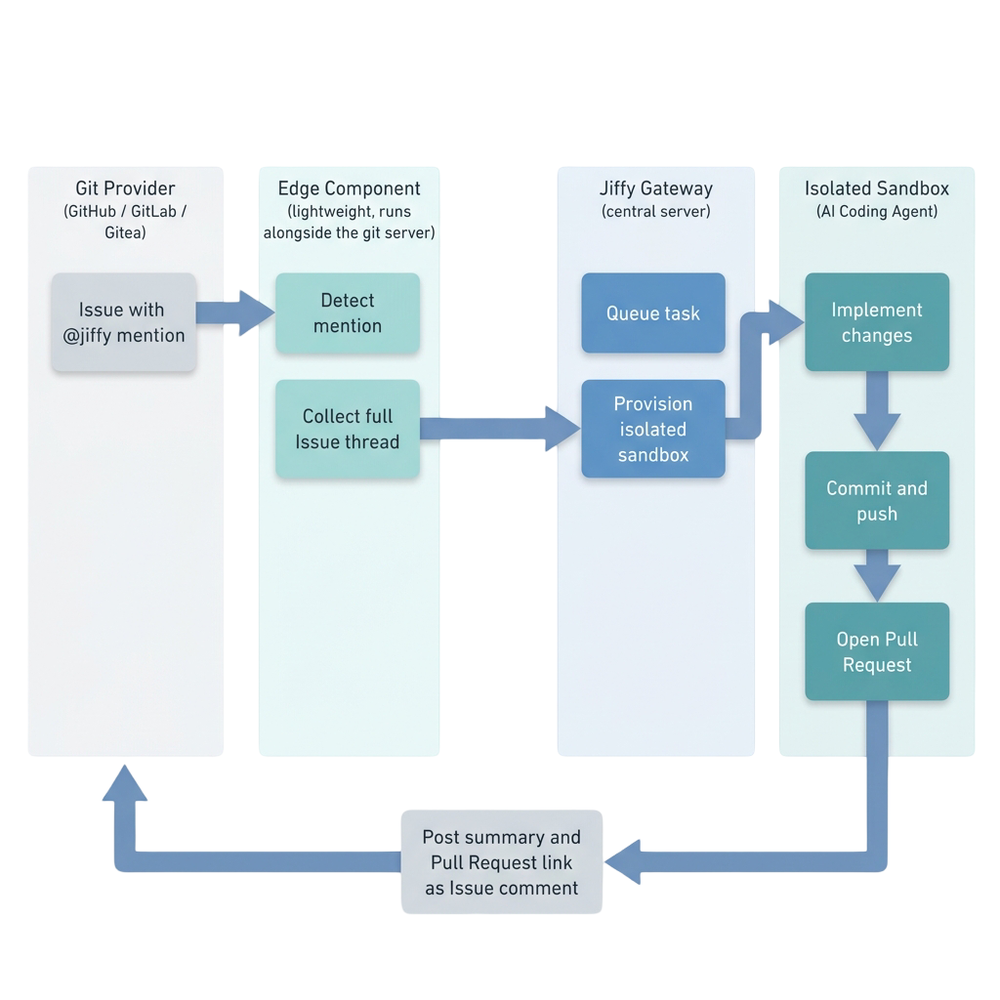

import { Callout } from 'fumadocs-ui/components/callout';
import { Steps, Step } from 'fumadocs-ui/components/steps';

Jiffy is split into a small number of pieces, each with exactly one responsibility. Nothing about the pipeline is provider-specific past the first stage — GitHub, GitLab, and Gitea all funnel into the same Gateway and the same sandbox.

## The pipeline

## Stage by stage

<Steps>
<Step>
### 1. Edge Component — detect and collect

A lightweight component lives in your own repository or infrastructure — a GitHub Action, a Gitea Action, or a small webhook relay for GitLab (which has no native mention-triggered CI job). It watches new Issues and Issue comments, and does exactly one thing before anything else happens: checks whether `@jiffy` was actually mentioned.

If it wasn't, the Edge Component stops right there — no request is ever sent, and the Gateway never even sees the event. If it was, the Edge Component collects the **full Issue thread** (the original body plus every comment) and forwards it as a single, pre-filtered payload.
</Step>

<Step>
### 2. Gateway — authenticate and queue

The payload is sent over HTTPS to the Gateway's provider-specific ingestion endpoint, authenticated with a shared secret in the `X-JIFFY-TOKEN` header — one secret per provider, so a leaked GitHub token can't be used to submit fake GitLab tasks. The Gateway validates the payload, records the task in durable storage, and places it on an internal task queue for the next free worker.

This is the only piece of Jiffy that's always running and always reachable from the outside — everything downstream of it only runs for the duration of a single task.
</Step>

<Step>
### 3. Sandbox — execute in isolation

A worker process picks up the task and starts an ephemeral, isolated container against a copy of the target repository. The sandbox image comes preloaded with the language toolchains a task might need and each provider's command-line tools for cloning, committing, and opening the PR. Inside it, the coding agent reads the Issue thread, makes the change, and commits it.

The worker never talks to the host's container runtime directly — a proxy layer sits in between and only allows the specific operations the worker needs (create/start/stop a container, stream its logs), so a compromised task can't reach anything else running on the host.
</Step>

<Step>
### 4. Callback — PR and report

Once the agent has committed its change, the sandbox pushes a new branch and opens a Pull Request (auto-named from the task if you didn't give it a branch name). The Gateway then posts a summary of what was done, with a link to the PR, back as a comment on the originating Issue — the same thread where the task started.
</Step>
</Steps>

<Callout type="info">
Every stage after the Edge Component is provider-agnostic. Adding a new channel — a chat app, a ticketing system — means writing a new Edge Component that speaks the Gateway's ingestion contract, not changing the Gateway or the sandbox.
</Callout>

## Where each piece runs

| Component | Runs where | Lifetime |
|---|---|---|
| Edge Component | Your git provider's CI (or a small relay process, for GitLab) | Per event — starts, checks for a mention, exits |
| Gateway | Your own infrastructure, always on | Long-running |
| Sandbox | An isolated container spawned by the Gateway's worker | Per task — created, runs, torn down |

For a deeper look at any one piece, see the [Submodules](/docs/submodules) docs — [Edge Component](/docs/submodules/edge-component), [Gateway](/docs/submodules/gateway), [Agent](/docs/submodules/agent), and [Sandbox](/docs/submodules/sandbox).
